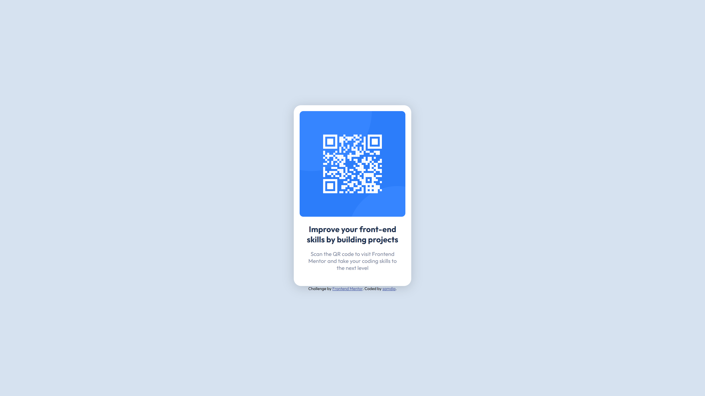

# Frontend Mentor - QR code component solution

This is a solution to the [QR code component challenge on Frontend Mentor](https://www.frontendmentor.io/challenges/qr-code-component-iux_sIO_H). Frontend Mentor challenges help you improve your coding skills by building realistic projects. 

## Table of contents

- [Overview](#overview)
  - [Screenshot](#screenshot)
  - [Links](#links)
- [My process](#my-process)
  - [Built with](#built-with)
  - [What I learned](#what-i-learned)
- [Author](#author)

## Overview

### Screenshot

### Links

- Solution URL: [https://www.frontendmentor.io/solutions/samdia-qr-code-component-XigARcKQf](https://www.frontendmentor.io/solutions/samdia-qr-code-component-XigARcKQf)
- Live Site URL: [samd1a.github.io/QR-code-component](https://samd1a.github.io/QR-code-component/)

## My process

### Built with

- Semantic HTML5 markup
- CSS custom properties
- Flexbox

### What I learned

- I learnt how to setup and utilize github pages to host projects.
- Learnt how to recreate a design without Figma to help me.

## Author

- Website - [www.samdia.cf](https://www.samdia.cf)
- Frontend Mentor - [@samd1a](https://www.frontendmentor.io/profile/samd1a)
- Twitter - [@samd1a](https://www.twitter.com/samd1a)
